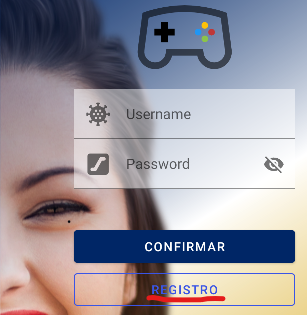
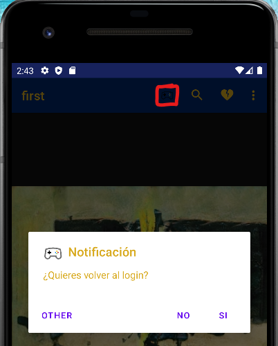

# Mi primer proyecto First
## Autor
**Alex Pallango**
## Concepto
---------------------------------- **SPLASH** --------------------------------------------------------------------- **LOGIN**

 

--------------------------------- **SIGNUP** ----------------------------------------------------------------------  **MAIN**

 

## Funcionamiento

Esta aplicacion consta de **4 activities** con sus respectivas **funciones**.

1. **Splash**

En este apartado, una vez entramos en la aplicación a traves del icono, lo primero que veremos es una animación en
diagonal de **abajo-ariba** en el que al final del trayecto el icono desaparece, toda esta animacion dura 3 seg
antes de entrar al activity de login. para conseguir este resultado, se consigue a traves del siguiente codigo [**java**](https://github.com/WOLFCRAY/first/blob/MaterialLogin/app/src/main/java/com/alemyapp/first/SplashScreen.java).

2. **Login**

En esta activity se ha recurrido a hacer un menu login para iniciar sesion en la app o para registrarse
teiendo de fondo una imagen y un degradado.

3. **Signup**

En el caso en el que elijamos la opción de registrarse, accederemos a este menu para registrarse  
el cual es parecido al de login, pero añadiendo un campo mas que es el email y cambiando la  
imagen del fondo.

4. **Main**

Independientemente de la activity en la que estemos, ya sea el **Login** o el **Signup**, una vez
elijamos la opcion de **confirmar**, accederemos al activity **Main**.

Aquí podemos observar un Toolbar con una serie de iconos los cuales tienen ciertas funcionalidades.

Si seleccionamos el icono del mando, se abre un dialogo de notificaciones el cual nos permite
volver a la activity **Login** siempre y cuando elijamos la opcion **SI**.

En cuanto al icono de **buscar** y el **corazon** si pinchamos ahí, nos crea un toast.

Tambien tenemos la opcion de juntar tanto un **toas** y una **ventana de dialogo** el
cual podemos encontrar en la parte del menu en otras opciones, la opción de **Perfil**.

  

Por otra parte tenemos una función en cuanto al activity **Main** el cual es una simulacion de
poder descargar la imagen el cual podemos acceder manteniendo presionado en la imagen.

Nos aparece esas dos opciones en cuanto elijamos una de las dos opciones se crea un toast ya sea
de una manera sencilla sin el cual podemos interactuar o otra en la cual sí que podemos como esta.

En resumen, esta es una pequeña simulación de lo que puede llegar a ser una app en su conjunto.
Para poder realizarla os dejo a continuacion mi proyecto de **GITHUB**.
>Repositorio Github del proyecto
>[First](https://github.com/WOLFCRAY/first/tree/MaterialLogin)