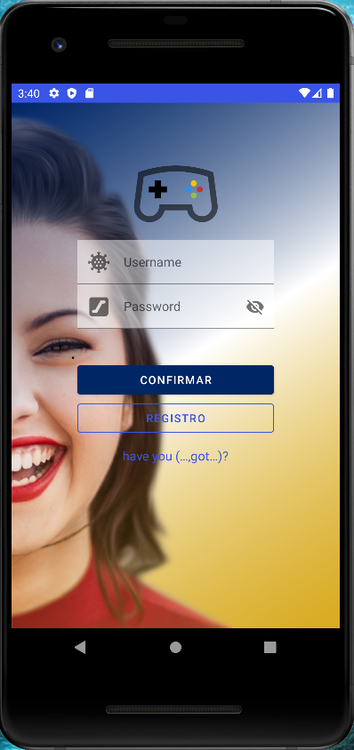
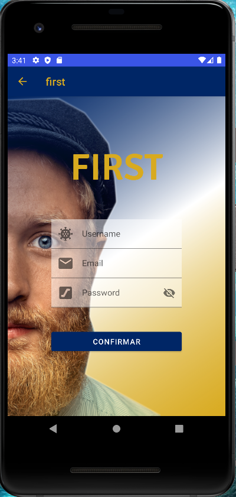

# Mi primer proyecto First
## Concepto
**SPLASH**  **LOGIN**   **SIGNUP**  **MAIN**

    
## Funcionamiento 

Esta aplicacion consta de **4 activities** con sus respectivas **funciones**.

1. **Splash**

En este apartado, una vez entramos en la aplicación a traves del icono, lo primero que veremos es una animación en
diagonal de **abajo-ariba** en el que al final del trayecto el icono desaparece, toda esta animacion dura 3 seg
antes de entrar al activity de login. para conseguir este resultado, se consigue a traves del siguiente codigo **xml** y **java**.

I'll meet you over there, can't wait to get started!

>This repository is licensed under
>[Creativecommons Org Licenses By Sa 4](http://creativecommons.org/licenses/by-sa/4.0/)